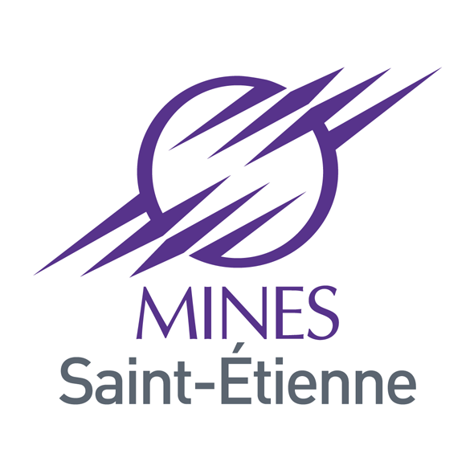
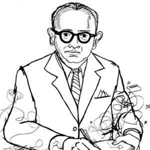
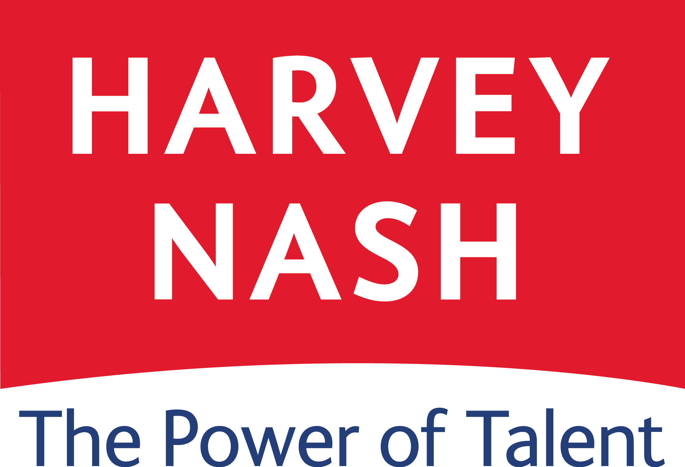

<!-- <section id="information" class="content">
  

    <h1 class="mvl">Tho VO</h1>
    <h2 class="mvl">Develop web with passion!</h2>
  

</section> -->

<!-- About Me -->
<section id="about" class="content">
  

    

      <h3 class="section-header">About
        Me
      </h3>
      <h4 class="section-subheader">Let me tell you my story!</h4>
    

    

      

        <h5 class="my-quote">
          Bring happiness to my clients with passion!
        </h5>
        

          <a href="https://www.facebook.com/tvotuong" targert="_blank"><i class="fa fa-facebook-square"></i></a>
          <a href="https://twitter.com/tho_vo" targert="_blank"><i class="fa fa-twitter-square"></i></a>
          <a href="https://plus.google.com/+ThọVõTường" targert="_blank"><i class="fa fa-google-plus-square"></i></a>
          <a href="https://www.linkedin.com/in/thovotuong" targert="_blank"><i class="fa fa-linkedin-square"></i></a>
        

      

      

        
      

      

        

          <h5 class="name">Tho VO</h5>
          <h6 class="job">Front End Developer</h6>
        

        

          
Hi, I'm a Front End Developer from Ho Chi Minh City, Vietnam. I am currently a Master student of Double Degrees Program between University of Jean Monet France and University of Alicante Spain.

          
I study about Machine Learning and Data Mining to apply this knowledge to Web Semantics, building smart and adaptive websites.

          <a class="download button radius" href="/resources/ThoVO-CurriculumVitae.pdf"><i class="fa fa-download"></i> Download Resume</a>
        

      

    

  

</section>

<!-- Work Experience -->
<section id="works" class="content">
  

    

      <h3 class="section-header">Work
        Experience
      </h3>
      <h4 class="section-subheader">What I have done!</h4>
    

    

      

        

          
        

        <!-- cd-timeline-img -->

        

          <h2>Internship at École nationale supérieure des mines de Saint-Étienne</h2>
          
My duty was worked under the supervisor of my professors to create a Tracking Indoor Positioning System based on some small and cheap devices like Arduino Uno board, Xbee shield and Ethernet shield. We expected to achieve a more economical system with higher accuracy.
          

          <!-- <a href="#0" class="cd-read-more">Read more</a> -->
          Mar 2015 - June 2015
        

        <!-- cd-timeline-content -->
      

      <!-- cd-timeline-block -->

      

        

          
        

        <!-- cd-timeline-img -->

        

          <h2>Senior Developer at Leo Burnett Vietnam</h2>
          
My reponsibility was coporated closely with Marketing team to build our own campaign, maintained and improved the client's website and did a lot of cool stuff like building a 777 Casino Slot Machine simulator and etc...

          <!-- <a href="#0" class="cd-read-more">Read more</a> -->
          Apr 2014 - Aug 2014
        

        <!-- cd-timeline-content -->
      

      <!-- cd-timeline-block -->

      

        

          
        

        <!-- cd-timeline-img -->

        

          <h2>Front End Developer at Harvey Nash Vietnam</h2>
          
From this moment, I've started to fall in love with Front End Development here. First, I began with beautiful design from Hearst Project, I built and maintained components for 18 websites of Hearst Magazines Corp. Afterwards, I joined another team maintaining Harvey Nash website. Thanks to the success of the Harvey Nash project, I gained the trust to build our own.

          <!-- <a href="#0" class="cd-read-more">Read more</a> -->
          Nov 2011 - Apr 2014
        

        <!-- cd-timeline-content -->
      

      <!-- cd-timeline-block -->
    

  

</section>

<!-- My Education -->
<section id="education" class="content">
  

    

      <h3 class="section-header">My
        Education
      </h3>
      <h4 class="section-subheader">What I have studied!</h4>
    

    

      

        <h5 class="education-title"><i class="fa fa-book"></i> Bachelor in Information System</h5>
        <h6 class="education-university"><i class="fa fa-university"></i> University of Sciences Ho Chi Minh City Vietnam</h6>
        

          This was the first step I had when I studied about Computer Science and other related subject. My profesors helped me build my basic knowledges to dig in deeply and researched information by myself. In this field, I had studied about information system, understood how this kind of system is operating and how to perform the control, optimize and use this system properly.
        

        

          <i class="fa fa-calendar"></i> 2007 - 2011
        

        

          
Status: <i class="fa fa-graduation-cap"></i>

        

      

      

        <h5 class="education-title"><i class="fa fa-book"></i> Master in Machine Learning and Data Mining</h5>
        <h6 class="education-university"><i class="fa fa-university"></i> University Jean Monnet France and University of Alicante Spain</h6>
        

          In this master program, I studied about Pattern Recognition, Machine Learning, Classification, Modelling, Knowledge Extraction and Data Mining. This is a step further from what I got in my Bachelor. I also wanted to bring these new knowledges to apply into Web Semantics, Video and Image Processing... With my own knowledges and my work experiences, I studied all the course with big interest.
        

        

          <i class="fa fa-calendar"></i> 2014-2016
        

        

          
Status: <i class="fa fa-spinner fa-spin"></i>

        

      

    

    

      

        <h5 class="education-title"><i class="fa fa-book"></i> M101JS: MongoDB for Node.js Developers and M101P: MongoDB for Developers</h5>
        <h6 class="education-university"><i class="fa fa-university"></i> MongoDB University <a href="https://university.mongodb.com/"><i class="fa fa-external-link"></i></a></h6>
        

          In this online course, I studied about how to use MongoDB in NodeJS environment (M101JS) and with Python (M101P) , some of basic command with MongoDB like CRUD, schema design, performance handler and aggregation framework that MongoDB supports.
        

        

          <i class="fa fa-calendar"></i> 2014
        

        

          
Certificate M101JS: <a href="/resources/Certificate_M101JS.pdf"><i class="fa fa-download "></i></a>

          
Certificate M101P: <a href="/resources/Certificate_M101P.pdf"><i class="fa fa-download "></i></a>

        

      

      

        <h5 class="education-title"><i class="fa fa-book"></i> Web Technologies</h5>
        <h6 class="education-university"><i class="fa fa-university"></i> openHPI <a href="https://open.hpi.de"> <i class="fa fa-external-link"></i></a></h6>
        

          In this online course, Prof. Dr. Christoph Meinel and colleagues taught me about the basic of Web Technologies, remind me some old definitions that I forgot, they also gave me the new information that was very helpful. In collaboration with other students, I consolidated my skills and my knowledges.
        

        

          <i class="fa fa-calendar"></i> 2015
        

        

          
Certificate Web Technologies: <a href="/resources/Certificate_WebTechnologies.pdf"><i class="fa fa-download "></i></a>

        

      

    

  

</section>

<!-- My project -->
<section id="project" class="content">
  

    

      <h3 class="section-header">My
        Project
      </h3>
      <h4 class="section-subheader">On going projects</h4>
    

  

  

    

      <h5 class="project-title"><i class="fa fa-mouse-pointer"></i> One design per week</h5>
      

        Transform beautiful design into real website is one of my passion. I want to do it everyday but I haven't enough time so I try to do at least one new design per week. I would public my source code and design file, read the comments to improve myself for future projects.
      

      

        <a href="#">See more <i class="fa fa-external-link"></i></a>
      

    

    

      <h5 class="project-title"><i class="fa fa-opencart"></i> Food Talk Project</h5>
      

        This is currently an open-source project. I worked with my friend to deal with food waste problem. We want to create a device that can attach easily everywhere, connect automatically with your application to track, guide and help you control your food in your fridge efficiently. Beside tracking, this device also gives proper and healthy recipes based on what you have. This project is still going and in design concept. We will try to have a real prototype soon.
      

      

        <a href="http://foodtalkproject.github.io/">See more <i class="fa fa-external-link"></i></a>
      

    

  

</section>

<!-- Contact me -->
<section id="contact" class="content">
  

    

      <h3 class="section-header">Contact
        Me
      </h3>
      <h4 class="section-subheader">Fire me an email!</h4>
    

  

  

    

      <form action="http://formspree.io/votuongtho@gmail.com" method="POST">
        <label for="_replyto">Your email:</label>
      <input class="" type="email" name="_replyto" placeholder="Your email">
      <label for="body">Your message:</label>
      <textarea class="" name="body" placeholder="Your message"></textarea>
      <input type="submit" value="Send" class="button radius tiny"></input>
    </form>
    

  

</section>
